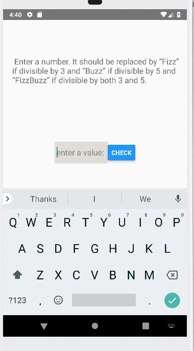
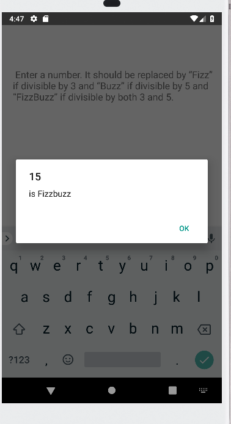
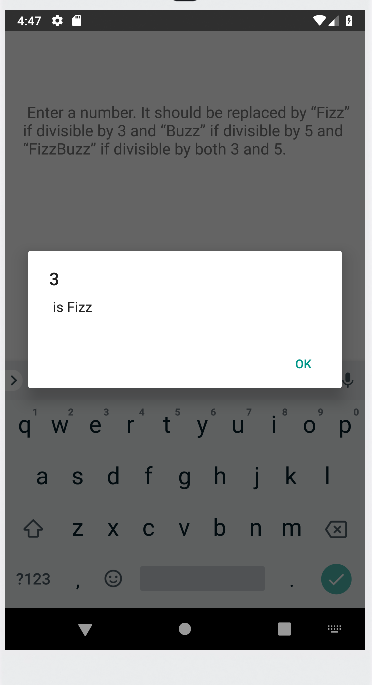
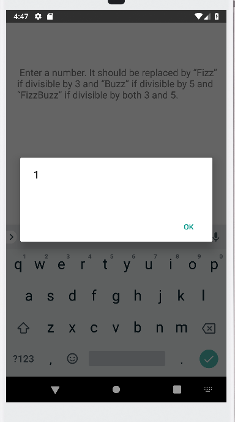

# FizzBuzz
Fizzbuzz is an simple when you enter a number, It should be replaced by “Fizz” if divisible by 3 and “Buzz” if divisible by 5 and “FizzBuzz” if divisible by both 3 and 5.

# Screenshots
    
